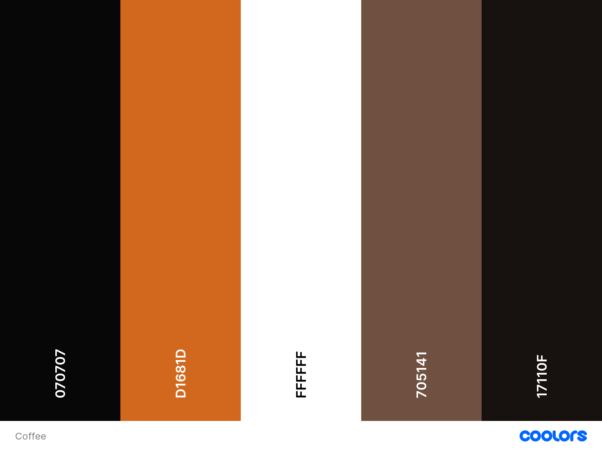
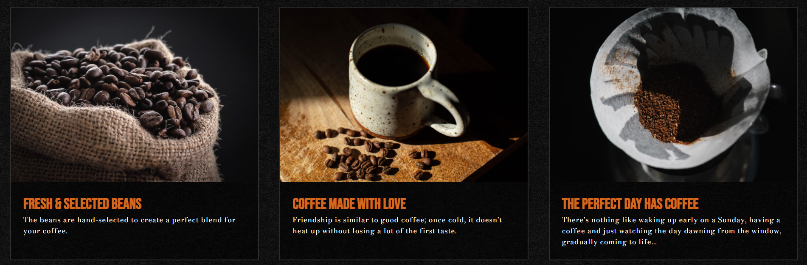
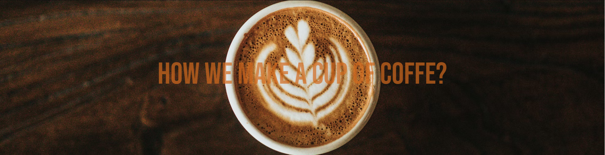
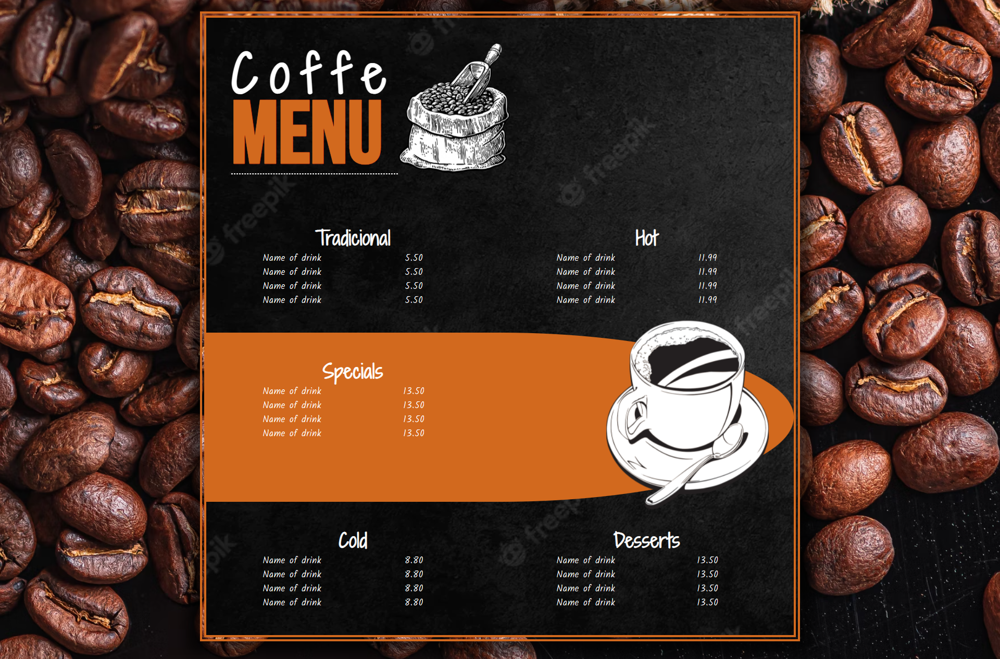
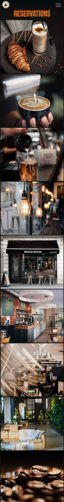
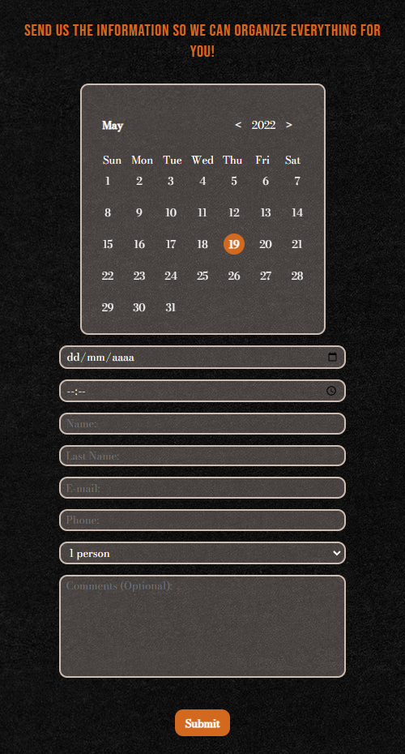
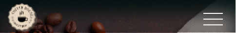
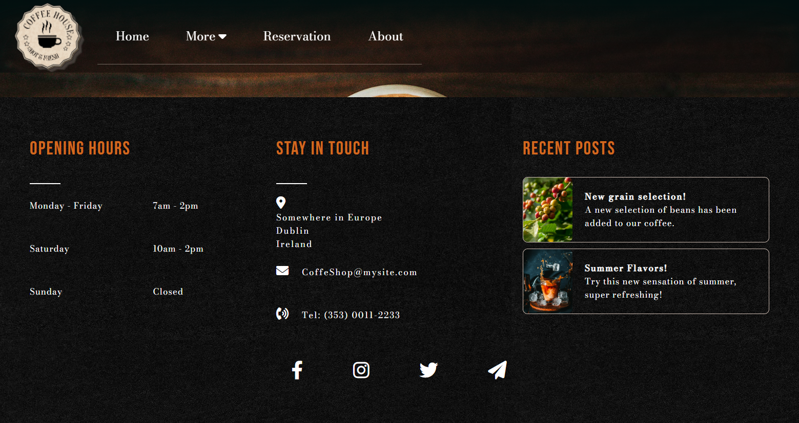

**
For lovers of all types of coffee
**

[View the live project here.](https://coffee---shop.herokuapp.com/)

## User Experience (UX)

-   ### User stories

    -   #### First Time Visitor Goals
    1. As a First Time Visitor, I want to immediately understand the intent of the site.
    2. As a First Time Visitor, I want to view and navigate the website on all devices.
    3. As a First Time Visitor, I want to have easy access to the menu (learning about the coffees on offer) and the reservation page (being easy and practical to do it).
    4. As a First Time Visitor, I want to know if it is reliable and professional.
    5. As a First Time Visitor, if I make a reservation, I would like a confirmation of my reservation to make sure it has been booked.

    -   #### Returning Visitor Goals
    1. As a Returning Visitor, I want to be able to subscribe to receive communications or promotions.
    2. As a Returning Visitor, I would like to be able to send messages or reviews to improve the establishment.
    3. As a Returning Visitor, I want to login so that I can manage my booking requests.

    -   #### Frequent User Goals
    1. As a Frequent User, I want to have new options on the menu in addition to the old ones.
    2. As a Frequent User, I want to see improvements on the site but without changing the instinct, so it doesn't make me confused.
    3. As a Frequent User, I want to feel stability and constancy in the changes.

## Technologies used

### Languages Used

- [HTML5](https://en.wikipedia.org/wiki/HTML5)

- [CSS3](https://en.wikipedia.org/wiki/CSS)

- [javaScript](https://en.wikipedia.org/wiki/JavaScript)

- [Python](https://en.wikipedia.org/wiki/Python_(programming_language))

### Frameworks Libraries and Programs

1. [Google Fonts](https://fonts.google.com/)
    - Google fonts were used to import the 'Bodoni Moda' and 'Bebas Neue' fonts into the style.css file which is used on all pages throughout the project.
1. [Line Awesome](https://icons8.com/line-awesome)
    - I used the icons for decoration and social media links
1. [Github](https://github.com/)
    - Github was used to create and store the project repository.
1. [Visual Studio Code](https://code.visualstudio.com/)
    - Visual Studio Code was used to create my files and code the project.
1. [Am I responsive](http://ami.responsivedesign.is/)
    - Am I responsive was used to taking screenshots of the page at different screen sizes.
1. [Mailtrap](https://mailtrap.io/)
    - Was used to test the codes for sending data to emails.
1. [BlueTree](https://bluetree.ai/screenfly/)
    - I used BlueTree to test the responsiveness and functionality of my website.
1. [PostgreSQL](https://www.postgresql.org/)
    - Open source object-relational database.
1. [Heroku](https://signup.heroku.com/)
    - Heroku was used to deploy the website.
1. [Git](https://git-scm.com/)
    - Git was used for version control by utilizing the Gitpod terminal to commit to Git and Push to Heroku. 
1. [Gunicorn](https://gunicorn.org/)
    - Gunicorn was used for deploying the project to Heroku.
1. [Unsplash](https://unsplash.com/)
    - All the pictures that I used on the website.
1. [Django](https://www.djangoproject.com/download/)
    - To connect Python with Postgre.
1. [Coolors](https://coolors.co/)
    - To get the website colors.

-   ### Design
    -   #### Colour Scheme
        -   The colors used on this website were:
        

    -   #### Typography Bebas Neue
        -   Bebas Neue was used for the titles and Bodoni Moda was used for texts and descriptions.

    -   #### Imagery
        -   All the images used have great contrasts and subtly have the tones that were used on the site.

## Features
- The website is responsive on all device sizes.

    ### Home Page
    

    - ### Links on top
        

        - The menu - The link takes the user to a page with the coffee options available at the establishment.
        - Our Grain selection - Directs the user to a page where it shows all the beans used in the coffee and how the coffee preparation is done.

    - ### 3 images with description
        
        

        - The images contain inviting and charismatic descriptions, so that the user feels invited to know more about suffering.

    - ### About
        
        

        - The about section is a brief description of what the website is currently offering to the user.
        - It is possible to see the text when the user hover over it.

    ### Menu Page
    

    - ### Menu
        
        

        - The menu is responsive and easy to understand.

    ### Reservation Page
    

    - ### Gallery
        
        

        - The gallery is fully responsive.
        - The gallery's intention is to draw the customer's attention and show the coffee shop environment.

    - ### Cups
        
        

        - The intention of the three glasses is to show several options of coffee with a brief description about.
        - This captivates the customer's desire to try it and thus make the reservation.

    - ### Calendar
        
        

        - The calendar serves to show the user the days that are already fully booked.
        - The user will be able to clearly see the dates available to make a reservation.

    ### Success Page
    

    - The user will be directed to this page when their reservation is submitted.
    - The user will have a confirmation that their reservation has been completed.

    ## Navbar
    
    
    
    - Navbar is always available to the user.
    - Simple and easily accessible.

    ## Footer
    
    

    - Contains the important information you need, such as contact information and business hours of the establishment.

## Testing
The W3C Markup Validator and W3C CSS Validator Services were used to validate every page of the project to ensure there were no syntax errors in the project.

- [Markup Validation Service](https://validator.w3.org/)
- [CSS Validation Service](https://jigsaw.w3.org/css-validator/)

## Credits

[Some phrases about coffee](https://www.pensador.com/frases_sobre_cafe/)
+ Some of the coffee phrases in the three images on the Home page came from this website.

[Calendar](https://github.com/trananhtuat/js-calendar)
+ Calendar code was created by this youtuber.

[Website Logo](https://www.pngwing.com/en/free-png-bwsac)
+ I downloaded from this link.

[Animate on scroll](https://github.com/michalsnik/aos)
+ I used this function from this repository

[Gallery on reservation page](https://github.com/saladestudo/tutorial-galeria-css-grid)
+ Gallery appearance was created by this youtuber.
